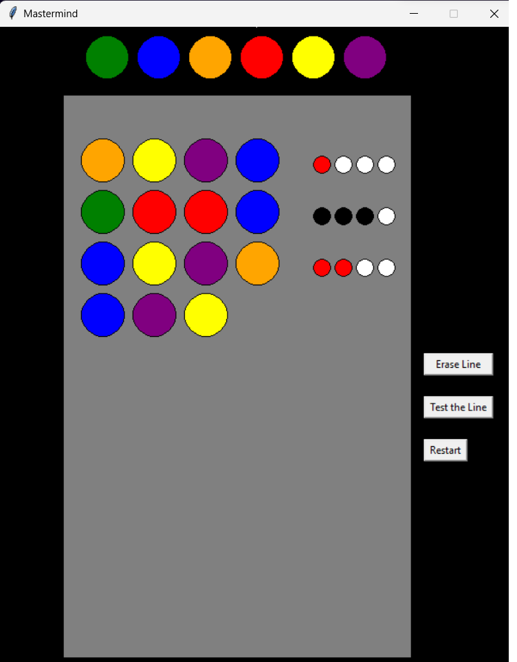

# Mastermind Game with Python and Pygame

This is a Python implementation of the classic Mastermind game, created using the Pygame framework. Mastermind is a code-breaking game where one player creates a secret code, and the other player tries to guess it within a limited number of attempts.

## Rules of the Game

### Objective
The objective of the game is for the codebreaker (Player) to guess the secret code within a certain number of attempts.

### Setup
1. The codemaker (Computer) selects a random secret code consisting of a sequence of colors.
2. The codebreaker (Player) is given a certain number of attempts to guess the code.

### Gameplay
1. The codebreaker (Player) enters their guess, then press test line and the game provides feedback.
2. If the codebreaker (Player) wants to reset the current line before testing it, you can press erase line and start again.
3. Feedback is given in the form of colored pegs or numbers, indicating:
   - The number of correct colors in the correct positions are indicated by red circles.
   - The number of correct colors in the wrong positions are indicated by white circles.
   - Colors that are not part of the secret code are indicated by black circles.
   - Careful the circles only indicate the number of right/wrong colors and not the position.
4. The codebreaker (Player) uses the feedback to refine their next guess.
5. The game continues until the codebreaker (Player) guesses the code or exhausts their attempts.

### Winning
- The codebreaker (Player) wins by correctly guessing the secret code within the allotted attempts.
- The codebreaker (Player) loses if the codebreaker (Player) cannot guess the code within the specified number of attempts.

## How to Play

1. Clone this repository to your local machine.
2. Make sure you have Python and Pygame installed.
3. Run the `Mastermind-GUI-V3.py` script.
4. The secret code is chosen randomly and you can start guessing.
5. Enjoy the challenge of code-breaking!

## Customization

Feel free to explore the code and make it your own!

## Credits

- This game was created by Ayoub Azmi and Hamza Essad.
- Special thanks to the Pygame community for their valuable resources.

Have fun playing Mastermind!

